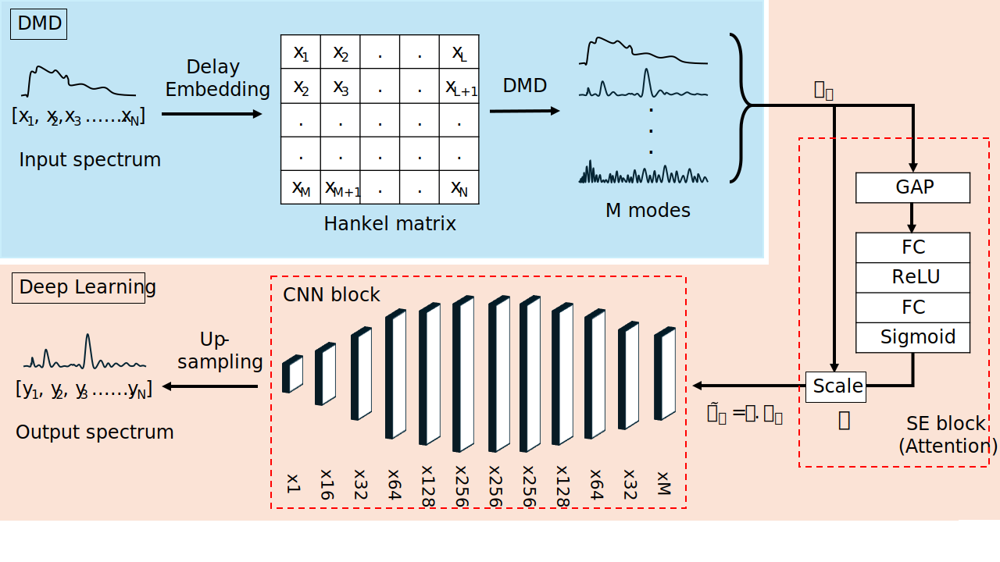

# **Deep Learning Enhanced Dynamic Mode Decomposition (DA-DMD) for NRB removal in CARS Spectroscopy**

  
   
  <em>DA-DMD method.</em>

## Overview
Write application, method.

## About Repository
Expand on files and stuff.

## Citation
**Authors:** Adithya Ashok Chalain Valapil, Carl Messerschmidt, Maha Shadaydeh, Michael Schmitt, Jürgen Popp, Joachim Denzler.
