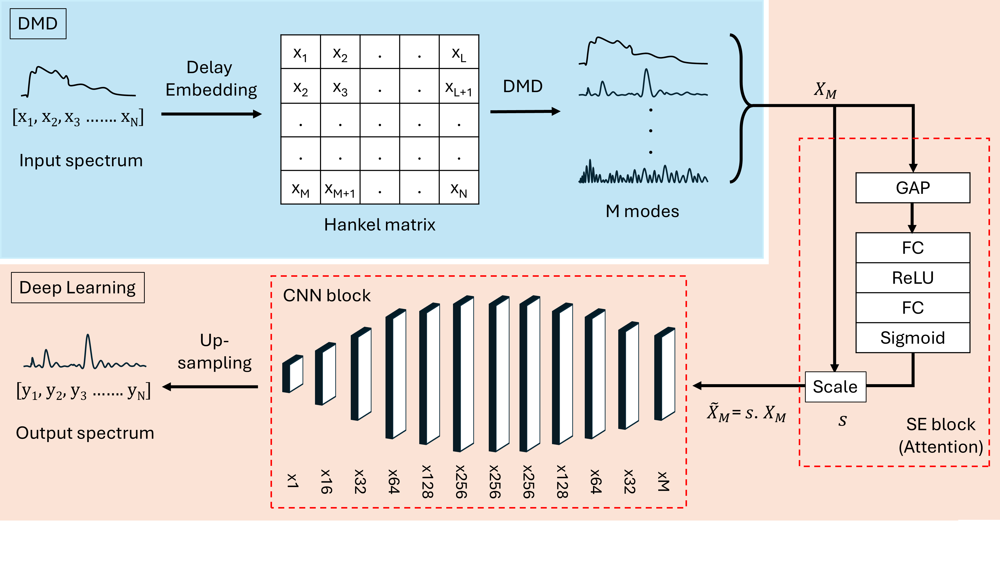

# **Deep Learning Enhanced Dynamic Mode Decomposition (DA-DMD) for NRB removal in CARS Spectroscopy**

**DMD** decomposes noisy input (CARS spectra) into different modes based on their frequency. **Deep learning** part uses SE Block for channel atention to weigh relevance of modes and then a CNN Block to extract the final clean output (Raman spectra). The noise (Non-resonant Background) has low frequency while the Raman signatures have higher frequencies. This criteria makes the background removal possible. To know more (link to paper). 

  
   
  <em>DA-DMD method.</em>

## Usage
We used NumPy 1.26.4, PyDMD 2024.12.1 and PyTorch 2.2.1 in this work. The [`example_dadmd.ipynb`](./example_dadmd.ipynb) notebook illustrates a training and testing example.

**Training:** You may train a new DA-DMD model using [`training_dadmd.py`](./training_dadmd.py). You may use the given sythetic cars-raman data pair or use synthetic generator [1](https://github.com/crimson-project-eu/NRB_removal/blob/main/synthetic-data-generator.py), [2](https://github.com/Junjuri/LUT/blob/main/RSS_Advances_CNN_to_train_with_different_NRBs.py) or [3](https://github.com/Valensicv/Specnet/blob/master/Specnet_Published.ipynb).

**Testing:** You may test the trained model using [`test_dadmd.py`](./test_dadmd.py) 

## Citation
**Authors:** Adithya Ashok Chalain Valapil, Carl Messerschmidt, Maha Shadaydeh, Michael Schmitt, Jürgen Popp, Joachim Denzler.

## Acknowledgements:
Funding:
